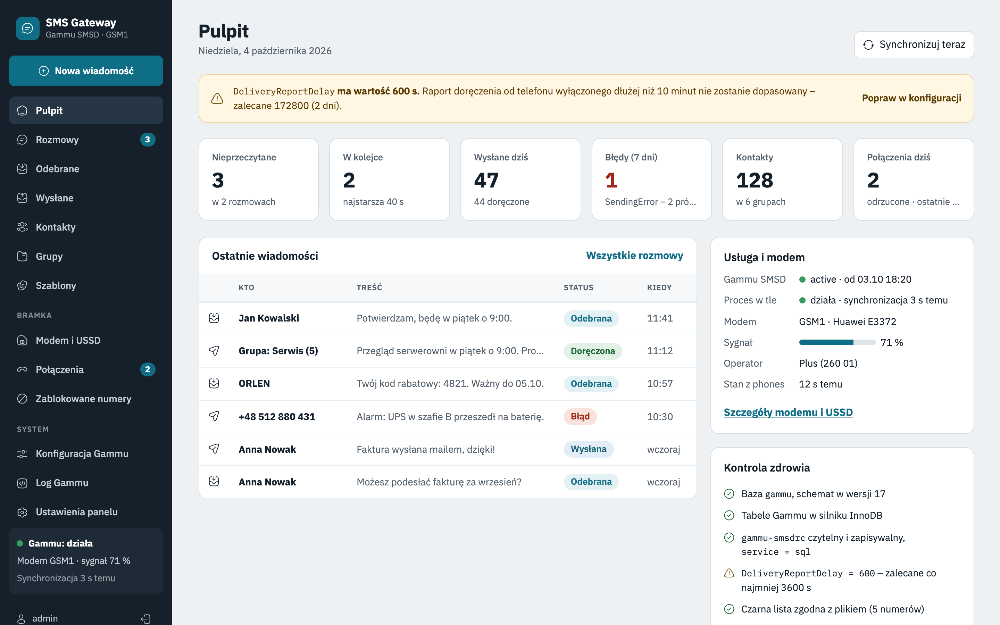
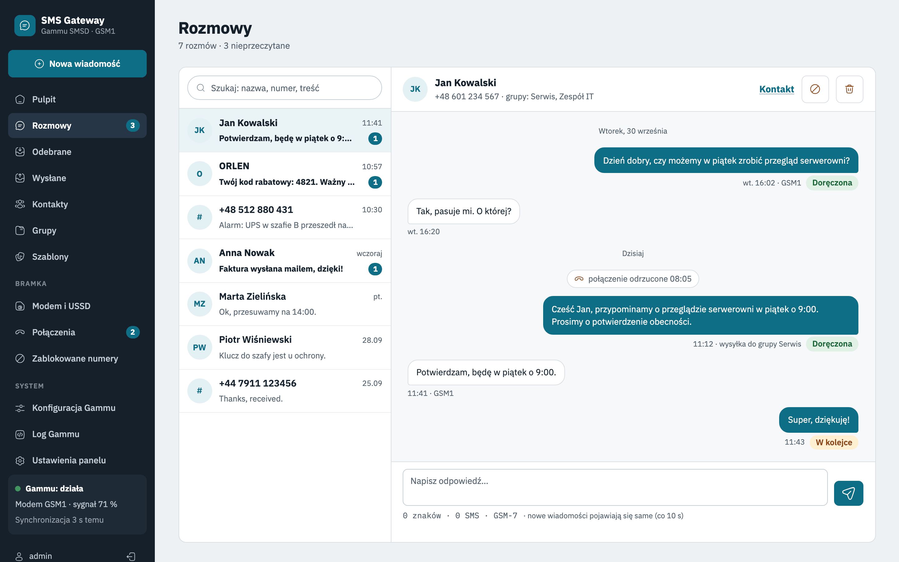
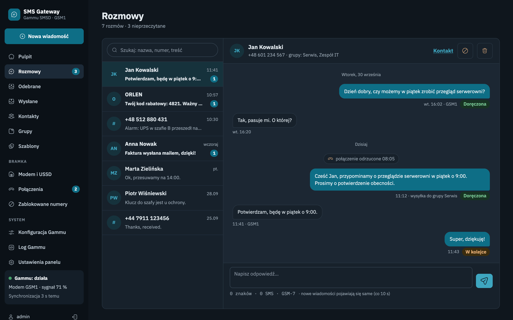
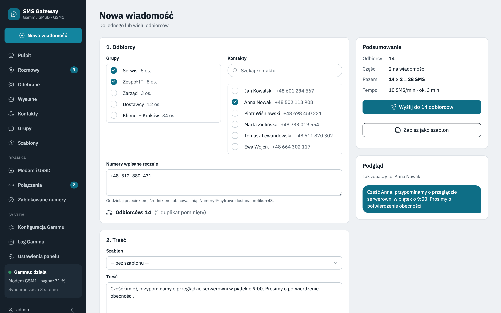
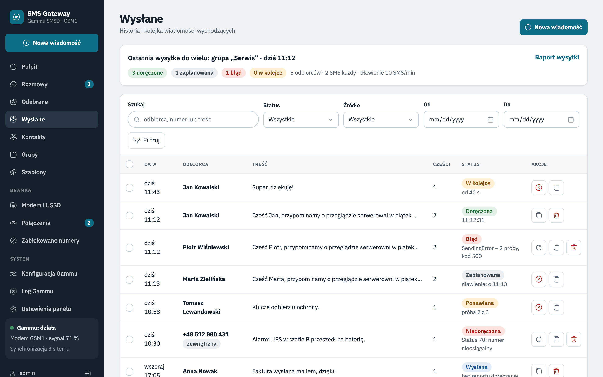
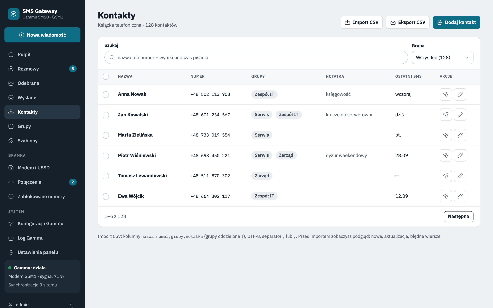
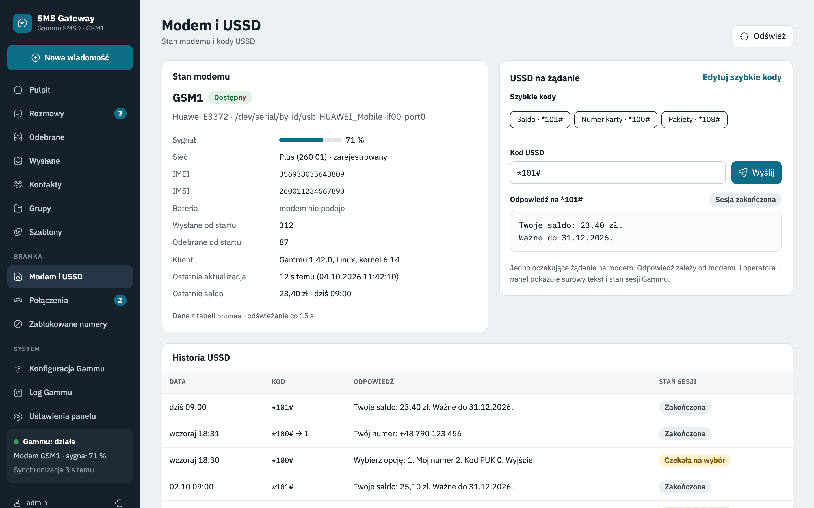
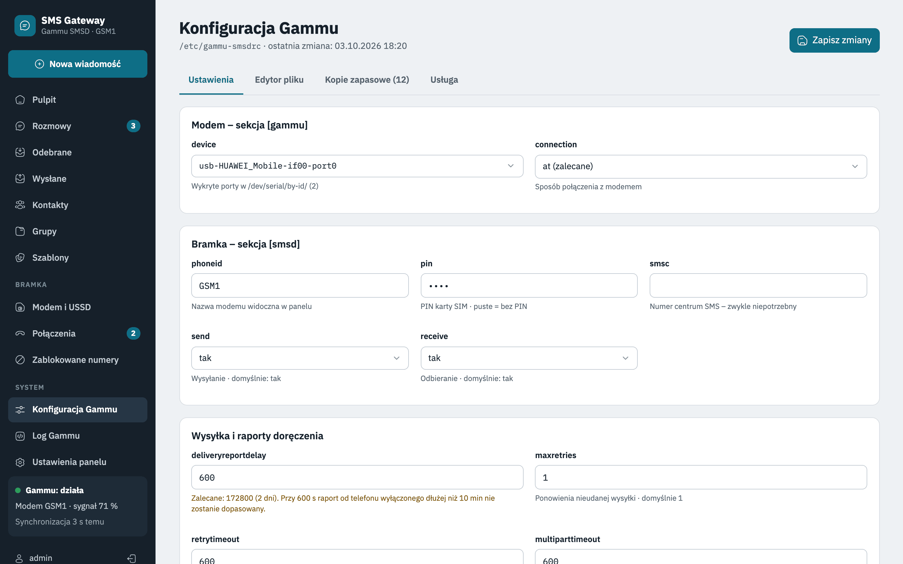
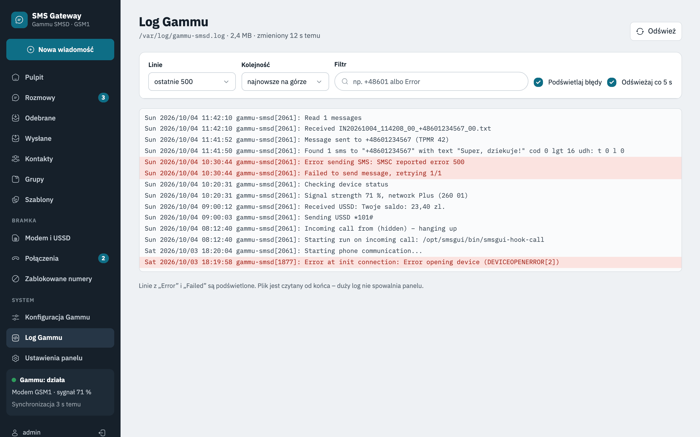

# Gammu SMSD Web UI

[Polski](README.md) | **English**

A web panel for an SMS gateway built on [Gammu SMSD](https://docs.gammu.org/smsd/) and a GSM modem, designed for
Ubuntu Server. Sending and receiving SMS, conversations, a phone book, delivery reports, USSD, rejected calls,
a blocklist, and Gammu configuration and diagnostics – all from the browser, without working in the console.

One-command installation: the script installs and configures Gammu SMSD, MariaDB, nginx and PHP, helps you choose
the modem and finishes with a health check.

> **Project status:** version 1.0.0-beta.1. The panel is feature-complete and tested on the Gammu simulator and on
> a clean Ubuntu Server 26.04.1 (installation, diagnostics, panel, automated tests). Tests with a real modem
> (sending, receiving, USSD, delivery reports) are in progress.
>
> The user interface is available in Polish and English (switchable in the panel settings). The installer and the
> console tool currently print messages in Polish.

<picture>
  <source media="(prefers-color-scheme: dark)" srcset="screenshots/dashboard-dark.png">
  
</picture>

## Contents

- [How it works](#how-it-works)
- [Features](#features)
- [Screenshots](#screenshots)
- [Technology](#technology)
- [Requirements](#requirements)
- [Installation](#installation)
- [Manual installation](#manual-installation)
- [After installation](#after-installation)
- [Configuration](#configuration)
- [Security](#security)
- [Updating, backups, uninstalling](#updating-backups-uninstalling)
- [Console tool](#console-tool)
- [Troubleshooting](#troubleshooting)
- [Development and tests](#development-and-tests)
- [License](#license)

## How it works

```
browser ──► nginx + PHP-FPM (panel) ──► MariaDB ◄── Gammu SMSD ◄──► GSM modem (USB)
                                         │  smsgui database – panel data
                                         │  gammu database  – Gammu queue and history
            smsgui-worker (background) ──┘  synchronisation every 3 s
```

Gammu SMSD drives the modem and works on the `gammu` database (SQL backend). The panel never talks to the modem
directly: it writes outgoing messages to the Gammu tables, and the `smsgui-worker` background process moves received
SMS, sending statuses, delivery reports and modem status into the panel database. As a result the panel keeps working
when the modem is temporarily unavailable, and Gammu keeps working when the panel is down.

The panel encodes and splits messages itself: it chooses GSM or Unicode and creates parts with a UDH header.
Gammu 1.42 does not split messages stored in the database, and with GSM encoding it silently replaces Polish
and other national characters (ą→a, ł→l).

## Features

**Sending**
- to one or many recipients: groups, contacts and numbers typed by hand – without duplicates, with a list of
  invalid numbers
- live character and part counter explaining the encoding (GSM / Unicode), automatic splitting into up to 10 parts,
  optional replacement of national characters (a longer message fits in one SMS)
- delivery report, flash SMS, scheduled sending, priority sending
- templates and personalisation (`{nazwa}` – full name, `{imie}` – first name; the same placeholders in both languages) with preview
- throttling (N SMS per minute) and a sending time window for bulk messages
- bulk sending report with a progress bar, “Retry failed”, “Cancel remaining”

**Messages**
- conversations as threads (like on a phone), replies without page reload, automatic refresh
- inbox and sent items with filters; statuses: queued, retrying, sent, delivered, undelivered, error –
  with a description of the network error code
- retrying and cancelling queued messages
- SMS sent by other means (e.g. `gammu-smsd-inject`) are shown too
- unread counter in the menu, optional automatic removal of history older than N days

**Contacts**
- phone book with groups, search as you type, bulk actions
- CSV import and export (Excel-compatible)
- contact name instead of the number throughout the panel

**Modem and Gammu**
- modem status: signal, operator, last update; detection of an unavailable modem
- on-demand USSD (e.g. account balance) with operator menu support and quick codes
- rejecting incoming calls, with a call list and entries in conversations
- number blocklist (Gammu rejects messages from blocked numbers)
- `/etc/gammu-smsdrc` configuration: form and editor with validation, a confirmation dialog with a line-by-line diff,
  backups with preview, comparison and restore, service reload and restart
- Gammu log viewer with a filter, error highlighting and live refresh

**Panel**
- dashboard with a health check: warnings with a hint on what to fix (database, Gammu schema, service, modem, queue,
  clock consistency, configuration)
- Polish and English interface, light and dark theme, works on phones
- a single account with lockout after 5 failed logins, “Remember me”, session expiry
- access from the local network only by default

**Planned (after 1.0):** forwarding SMS and calls to e-mail and webhooks, HTTP API, auto-replies,
periodic balance checks, admin notifications, statistics, multiple modems.

## Screenshots

Screenshots show the Polish interface (English is available in the panel settings). Light and dark themes follow the system setting. Click a thumbnail for full size.

<table>
  <tr>
    <td width="50%"><a href="screenshots/threads.png"></a><br><sub>Conversations</sub></td>
    <td width="50%"><a href="screenshots/threads-dark.png"></a><br><sub>Conversations – dark theme</sub></td>
  </tr>
  <tr>
    <td width="50%"><a href="screenshots/compose.png"></a><br><sub>New message to groups and contacts</sub></td>
    <td width="50%"><a href="screenshots/sent.png"></a><br><sub>Sent – statuses and delivery reports</sub></td>
  </tr>
  <tr>
    <td width="50%"><a href="screenshots/contacts.png"></a><br><sub>Contacts and groups</sub></td>
    <td width="50%"><a href="screenshots/modem.png"></a><br><sub>Modem and USSD</sub></td>
  </tr>
  <tr>
    <td width="50%"><a href="screenshots/config.png"></a><br><sub>Gammu configuration</sub></td>
    <td width="50%"><a href="screenshots/log.png"></a><br><sub>Gammu log</sub></td>
  </tr>
</table>

## Technology

| Layer | Technology |
|-------|------------|
| SMS gateway | Gammu SMSD 1.42 with the SQL backend (`native_mysql`), database schema version 17 |
| Database | MariaDB (InnoDB tables – transactions when writing multipart messages) |
| Application | PHP 8.5 without a framework and without Composer; PDO, database migrations built into the panel |
| User interface | [htmx](https://htmx.org) 2, [Pico.css](https://picocss.com) 2, IBM Plex fonts, [Solar](https://icon-sets.iconify.design/solar/) icons – all bundled locally, no npm and no build step |
| Server | nginx + PHP-FPM, systemd (background process), logrotate, optionally fail2ban |

The panel runs under a strict CSP (`default-src 'self'`, no inline scripts or styles) and loads nothing from
external servers.

## Requirements

| Item | Requirement |
|------|-------------|
| System | **Ubuntu Server 26.04 LTS** (tested on 26.04.1). Older releases do not ship PHP 8.5 |
| Repositories | `main` and `universe` (`gammu-smsd`, `php-fpm`, `php-mbstring` and others come from `universe`) |
| Hardware | a USB or serial GSM modem supported by Gammu (AT commands), an active SIM card – PIN disabled or known |
| Packages | `gammu`, `gammu-smsd`, `mariadb-server`, `nginx`, `php-fpm`, `php-cli`, `php-mysql`, `php-mbstring`, `openssl`, `git` |
| PHP | 8.5 or newer with the `pdo_mysql` and `mbstring` extensions; PHP-FPM of the same version as PHP CLI |
| Permissions | an account with `sudo`; MariaDB `root` access through the socket (Ubuntu default) |
| Network | access to Ubuntu repositories and GitHub during installation; the panel – from the local network |

Versions tested on Ubuntu 26.04.1: Gammu 1.42.0, MariaDB 11.8.6, nginx 1.28.3, PHP 8.5.4.

## Installation

```bash
curl -fsSL https://raw.githubusercontent.com/ookris/Gammu-SMSD-Web-UI/main/deploy/install.sh | sudo bash
```

You can also clone the repository first and run the script from it:

```bash
sudo git clone https://github.com/ookris/Gammu-SMSD-Web-UI.git /opt/smsgui
sudo /opt/smsgui/deploy/install.sh
```

### Installation modes

The installer first asks for the mode:

| | `full` (default) | `app` |
|---|---|---|
| For whom | a clean server, a typical installation | an administrator who manages packages themselves (e.g. PHP from another repository) |
| System packages | shows a list (✔ present / → to install) and installs **only the missing ones**, with a progress bar | **installs nothing** – checks that the required programs are present and, if not, stops and prints the `apt install` command |
| What is checked | package presence | that programs work: PHP ≥ 8.5 with `pdo_mysql` and `mbstring`, PHP-FPM of the same version, MariaDB access, Gammu and the `gammu-smsd` service, nginx, OpenSSL |
| Databases, Gammu, nginx, panel | configured | configured (same as `full`) |

Neither mode upgrades packages that are already installed. The full `apt-get` output goes to
`/var/log/smsgui-install.log` (on error the installer shows its last lines). If you prefer to configure each part
yourself, see [Manual installation](#manual-installation).

### What the installer does

1. Downloads the application to `/opt/smsgui` (or updates it with `git pull`).
2. Installs or checks packages (depending on the mode); checks PHP ≥ 8.5 and the PHP-FPM socket.
3. Creates the `gammu` and `smsgui` databases and the `gammu`, `smsgui`, `smsgui_hook` accounts with random passwords
   (stored in `/etc/smsgui/secrets.env`, root only); creates the Gammu tables from the package script and converts
   them to InnoDB.
4. Sets up files, data directories and permissions, and a sudoers entry (Gammu reload and restart only).
5. Modem wizard: probes the ports in `/dev/serial/by-id/` (`gammu identify`), lets you choose one, checks the SIM state
   and **the PIN – only once** (stops on a wrong PIN so the card does not get blocked). Configures `/etc/gammu-smsdrc`
   (SQL backend, log file, delivery reports) – changes only the required lines and saves a copy as
   `/etc/gammu-smsdrc.smsgui-YYYYMMDD-HHMMSS`.
6. Creates the panel tables, starts the `smsgui-worker` background process, configures nginx (optionally HTTPS
   with a self-signed certificate), a logrotate rule and a fail2ban filter (disabled).
7. Asks for the panel login and password, runs the health check and optionally sends a test SMS.

The installer is **idempotent**: running it again updates the code, repairs permissions and does not change an already
configured modem or account. The panel also installs without a modem (answer `skip` to the port question) –
after connecting the modem simply run the script again.

### Unattended installation

All answers can be passed as environment variables:

| Variable | Meaning | Default |
|----------|---------|---------|
| `SMSGUI_MODE` | mode: `full` / `app` | `full` |
| `SMSGUI_MODEM` | modem port path or `skip` | first working port |
| `SMSGUI_PIN` | SIM PIN (only if the card requires it) | – |
| `SMSGUI_PHONEID` | modem name in Gammu (`PhoneID`) | `GSM1` |
| `SMSGUI_HOST` | panel host name in nginx | `hostname -f` |
| `SMSGUI_HTTPS` | `none` / `self-signed` | `none` |
| `SMSGUI_USER`, `SMSGUI_PASSWORD` | panel login and password (password ≥ 10 characters) | `admin` / – |
| `SMSGUI_TEST_NUMBER` | number for the test SMS (empty = no test) | – |
| `SMSGUI_DIR`, `SMSGUI_REPO`, `SMSGUI_BRANCH` | directory, repository and branch to download | `/opt/smsgui`, this repository, `main` |

```bash
sudo SMSGUI_MODE=full SMSGUI_MODEM=skip SMSGUI_HTTPS=none SMSGUI_USER=admin SMSGUI_PASSWORD='…' /opt/smsgui/deploy/install.sh
```

## Manual installation

For those who prefer to configure everything themselves. The commands match what the installer does;
generate the passwords `<gammu-password>`, `<smsgui-password>`, `<hook-password>` e.g. with `openssl rand -hex 16`.
**Rule:** Gammu must work first, the panel comes second.

### 1. Gammu and the modem

```bash
sudo apt update
sudo apt install gammu gammu-smsd
ls -l /dev/serial/by-id/          # stable port name (better than /dev/ttyUSB0)
```

A USB modem usually exposes several ports – the right one is where `gammu identify` responds:

```bash
printf '[gammu]\ndevice = /dev/serial/by-id/usb-…-port0\nconnection = at\n' > /tmp/gammurc
gammu -c /tmp/gammurc identify             # manufacturer, model, IMEI
gammu -c /tmp/gammurc getsecuritystatus    # whether the card requires a PIN
```

### 2. Database

```bash
sudo apt install mariadb-server
sudo mariadb <<'SQL'
CREATE DATABASE gammu  CHARACTER SET utf8mb4 COLLATE utf8mb4_unicode_ci;
CREATE DATABASE smsgui CHARACTER SET utf8mb4 COLLATE utf8mb4_polish_ci;
CREATE USER 'gammu'@'localhost'       IDENTIFIED BY '<gammu-password>';
CREATE USER 'smsgui'@'localhost'      IDENTIFIED BY '<smsgui-password>';
CREATE USER 'smsgui_hook'@'localhost' IDENTIFIED BY '<hook-password>';
GRANT SELECT, INSERT, UPDATE, DELETE ON gammu.* TO 'gammu'@'localhost';
GRANT ALL ON smsgui.* TO 'smsgui'@'localhost';
GRANT SELECT, INSERT, UPDATE, DELETE ON gammu.* TO 'smsgui'@'localhost';
SQL
sudo mariadb gammu < /usr/share/doc/gammu-smsd/examples/mysql.sql     # other releases may ship mysql.sql.gz
for t in gammu inbox outbox outbox_multipart phones sentitems; do
    sudo mariadb gammu -e "ALTER TABLE $t ENGINE=InnoDB"               # the package script creates MyISAM tables
done
```

If the package has no schema script, use `deploy/sql/gammu-mysql-17.sql` from this repository (step 4).

### 3. Gammu SMSD configuration

`/etc/gammu-smsdrc` – the minimum the panel needs:

```ini
[gammu]
device = /dev/serial/by-id/usb-…-port0
connection = at

[smsd]
service = sql
driver = native_mysql
host = localhost
user = gammu
password = <gammu-password>
database = gammu
phoneid = GSM1
pin = 1234
logfile = /var/log/gammu-smsd/smsd.log
debuglevel = 1
deliveryreportdelay = 172800
```

`pin` – only if the card requires it. `deliveryreportdelay = 172800` (2 days) lets Gammu match a delivery report from
a phone that was switched off for a long time (by default Gammu waits only 10 minutes).

```bash
sudo install -d -m 0750 -g www-data /var/log/gammu-smsd
sudo chown root:www-data /etc/gammu-smsdrc && sudo chmod 0660 /etc/gammu-smsdrc   # the panel edits this file
sudo systemctl enable --now gammu-smsd
sudo tail -f /var/log/gammu-smsd/smsd.log
```

Test without the panel:

```bash
sudo gammu-smsd-inject TEXT +48601234567 -text 'Test'
sudo mariadb gammu -e 'SELECT ID, Status FROM sentitems ORDER BY ID DESC LIMIT 1'
```

### 4. Web packages and application code

```bash
sudo apt install nginx php-fpm php-cli php-mysql php-mbstring git
sudo git clone https://github.com/ookris/Gammu-SMSD-Web-UI.git /opt/smsgui
sudo install -d -o www-data -g www-data -m 0750 /var/lib/smsgui /var/lib/smsgui/backups /var/lib/smsgui/sessions
sudo install -o www-data -g www-data -m 0644 /dev/null /var/lib/smsgui/exclude-numbers.txt
sudo install -o www-data -g www-data -m 0640 /dev/null /var/lib/smsgui/smsgui.log
```

The code is owned by `root` and read-only for `www-data`; only the data in `/var/lib/smsgui` is writable.

`/opt/smsgui/config/config.php` (owner `root:www-data`, mode `0640`) – overrides only the values needed from
`config/config.example.php`:

```php
<?php
return [
    'db' => ['password' => '<smsgui-password>'],
    'hook' => ['command' => '/usr/bin/php /opt/smsgui/bin/smsgui hook call', 'cnf' => '/etc/smsgui/hook.cnf'],
];
```

`/etc/smsgui/hook.cnf` (directory `0750`, file `0640`, both `root:root`) – credentials Gammu uses to record incoming calls:

```ini
[client]
user = smsgui_hook
password = <hook-password>
socket = /run/mysqld/mysqld.sock
database = smsgui
```

sudoers entry – the panel may only reload and restart Gammu:

```bash
sudo install -m 0440 /opt/smsgui/deploy/sudoers-smsgui /etc/sudoers.d/smsgui
sudo visudo -c
```

### 5. nginx

```bash
sed -e 's#__ROOT__#/opt/smsgui#g' -e 's#__FPM__#/run/php/php8.5-fpm.sock#g' -e 's#__HOST__#sms.example.lan#g' \
    /opt/smsgui/deploy/nginx-smsgui.conf | sudo tee /etc/nginx/sites-available/smsgui >/dev/null
sudo ln -sf /etc/nginx/sites-available/smsgui /etc/nginx/sites-enabled/smsgui
sudo rm -f /etc/nginx/sites-enabled/default
sudo nginx -t && sudo systemctl reload nginx
```

The template executes only `public/index.php`, blocks hidden files and admits local network addresses only.
The PHP-FPM socket must match the version reported by `php -v`.

### 6. Panel tables, background process and account

```bash
sudo -u www-data php /opt/smsgui/bin/smsgui setup db       # panel tables (migrations)
sudo mariadb -e "GRANT INSERT (phone, raw_number, modem, received_at) ON smsgui.calls TO 'smsgui_hook'@'localhost'"
sed 's#__ROOT__#/opt/smsgui#g' /opt/smsgui/deploy/smsgui-worker.service | sudo tee /etc/systemd/system/smsgui-worker.service >/dev/null
sudo systemctl daemon-reload && sudo systemctl enable --now smsgui-worker
sudo -u www-data php /opt/smsgui/bin/smsgui passwd admin   # asks for the password
```

### 7. Gammu log and fail2ban (optional)

```bash
sudo cp /opt/smsgui/deploy/logrotate-gammu-smsd /etc/logrotate.d/gammu-smsd-smsgui
sudo cp /opt/smsgui/deploy/fail2ban/filter.d/smsgui.conf /etc/fail2ban/filter.d/
sudo cp /opt/smsgui/deploy/fail2ban/jail.d/smsgui.conf /etc/fail2ban/jail.d/   # jail disabled – see Security
```

### 8. Check

```bash
sudo -u www-data php /opt/smsgui/bin/smsgui check
```

`check` prints a ✔/✘ list with hints – the same check is shown on the panel dashboard.

## After installation

The panel is available at `http://<server-name-or-IP>/`. After logging in, the dashboard shows the health check – all
items should be green once the modem works. Further configuration is done in the panel:

- **Gammu configuration** – modem and gateway parameters, file editor, backups, service reload and restart;
- **Panel settings** – language, default sending options, throttling, sending window, USSD quick codes, call
  rejection, session lifetime, history cleanup, number of configuration backups;
- **Blocked numbers** – enabling the blocklist for the first time adds `ExcludeNumbersFile` to the Gammu configuration
  (through the confirmation dialog).

## Configuration

Day-to-day settings are changed in the panel (stored in the database). System settings – paths, database credentials
and commands – live only in `config/config.php` and cannot be changed from the browser (the panel shows them
read-only, without passwords). `config.php` contains only the values that differ from `config/config.example.php`:

| Key | Meaning | Default |
|-----|---------|---------|
| `db.dsn`, `db.user`, `db.password` | panel database connection | socket `/run/mysqld/mysqld.sock`, database and account `smsgui` |
| `gammu_db` | Gammu database name | `gammu` |
| `gammu_conf` | Gammu configuration file | `/etc/gammu-smsdrc` |
| `gammu_log` | Gammu log (`null` = `logfile` from `gammu-smsdrc`) | `null` |
| `service.*_cmd` | service status, reload and restart commands | `systemctl` / `sudo -n systemctl … gammu-smsd` |
| `gammu_rows` | Gammu rows after import: `keep` (marked as processed) / `delete` | `keep` |
| `worker_interval` | background synchronisation interval in seconds | `3` |
| `default_country_code`, `national_number_length` | phone number normalisation | `48`, `9` |
| `max_recipients` | recipient limit per sending | `500` |
| `timezone` | panel time zone | `Europe/Warsaw` |
| `log_path`, `backup_dir`, `session_path`, `blocklist_file` | data files and directories | in `/var/lib/smsgui` |
| `debug` | error details on screen (for diagnostics only) | `false` |

## Security

- **Local network access only** – an `allow`/`deny` rule in the nginx configuration. For remote access a VPN
  (WireGuard, Tailscale) is recommended. If you expose the panel directly: HTTPS (`sudo certbot --nginx`) and the
  fail2ban jail enabled (`enabled = true` in `/etc/fail2ban/jail.d/smsgui.conf`).
- **Login:** lockout for 15 minutes after 5 failed attempts, `HttpOnly` and `SameSite` cookies, CSRF protection on
  all forms, failed logins recorded in `/var/lib/smsgui/smsgui.log` (fail2ban format).
- **System permissions:** the panel runs as `www-data`; through sudo it can only reload and restart `gammu-smsd`.
  The panel can write `/etc/gammu-smsdrc` (always after confirmation and with a backup) – anyone with access to the
  panel therefore has full control over the SMS gateway. The editor warns about every `RunOn…` parameter not set by
  the panel.
- **Databases:** separate accounts with minimal privileges; the call hook account can only insert rows into one table.
  Passwords: `/etc/smsgui/secrets.env` (root only), `config/config.php` (`0640 root:www-data`).
- Passwords and the PIN from `gammu-smsdrc` never reach the browser (masked in the form, editor and diffs).

## Updating, backups, uninstalling

**Updating** – run the installation command again (it does `git pull` and checks the configuration without asking
again), or:

```bash
sudo git -C /opt/smsgui pull --ff-only
sudo -u www-data php /opt/smsgui/bin/smsgui check     # database migrations run automatically
```

The background process restarts itself when files change. `config.php` and data are not overwritten.

**Backups:**

```bash
sudo mariadb-dump --single-transaction --databases smsgui gammu | gzip > smsgui-$(date +%F).sql.gz
```

Also include `/etc/gammu-smsdrc`, `/opt/smsgui/config/config.php`, `/etc/smsgui/` and `/var/lib/smsgui/`.

**Uninstalling:**

```bash
sudo /opt/smsgui/deploy/uninstall.sh            # removes the panel, keeps the data (smsgui database, /var/lib/smsgui)
sudo /opt/smsgui/deploy/uninstall.sh --purge    # also removes panel data, the smsgui database and its accounts
```

Gammu SMSD and the `gammu` database keep working; only the settings added by the panel are removed from `gammu-smsdrc`.

## Console tool

Run as `www-data`: `sudo -u www-data php /opt/smsgui/bin/smsgui <command>`.

| Command | Action |
|---------|--------|
| `check [--quiet]` | health check (database, Gammu schema, table engine, configuration, service, modem, queue); exit code ≠ 0 on error – suitable for monitoring |
| `passwd [login]` | set login and password (e.g. forgotten password) |
| `send <number> <text> [--wait=N]` | test sending, optionally waiting for the result |
| `cleanup --days=N` | remove history older than N days |
| `worker` / `sync` | background process / one-off synchronisation |
| `setup db` / `setup gammu` / `setup unhook` | installer and uninstaller steps |
| `hook call --phone=ID [number]` | record an incoming call (called by Gammu via `RunOnIncomingCall`) |

## Troubleshooting

| Symptom | What to check |
|---------|---------------|
| Warnings on the dashboard | each has a hint; the same in the console: `sudo -u www-data php /opt/smsgui/bin/smsgui check` |
| Gammu service `failed` | `journalctl -u gammu-smsd -n 50` and `/var/log/gammu-smsd/smsd.log` – usually the modem port or PIN |
| Modem does not register | `ls -l /dev/serial/by-id/`, `gammu identify` on the chosen port; after connecting the modem run the installer again |
| Messages stuck in the queue | whether Gammu is running and the modem is registered in the network (Modem screen), Gammu log |
| Error 502 in the browser | `systemctl status php8.5-fpm`; the socket in `/etc/nginx/sites-available/smsgui` must match `php -v` |
| Panel does not show new SMS | `systemctl status smsgui-worker` (background process) |
| Forgotten password | `sudo -u www-data php /opt/smsgui/bin/smsgui passwd` |
| Installation problem | `/var/log/smsgui-install.log` (apt output) |

When reporting a problem, attach the report from `sudo bash /opt/smsgui/deploy/collect-info.sh > info.txt 2>&1` –
the script only reads the system state and masks passwords and the PIN.

Logs: panel – `/var/lib/smsgui/smsgui.log`, Gammu – `/var/log/gammu-smsd/smsd.log`, background process –
`journalctl -u smsgui-worker`, nginx – `/var/log/nginx/error.log`.

## Development and tests

Local development (macOS) without a modem – with a Gammu SMSD simulator that behaves like Gammu 1.42 on the
`gammu_dev` database (sending, retries, delivery reports, multipart receiving, USSD, calls, blocklist).
Requires PHP 8.5 and MariaDB from Homebrew (`brew install php mariadb@11.8`); MariaDB runs as a separate instance
on port 3307 (data in `~/.local/share/smsgui-mariadb`), so it does not clash with another MySQL server.

```bash
tests/db/mariadb.sh start                           # MariaDB on 127.0.0.1:3307 (stop | status | client [db])
SIM_DB_PORT=3307 php tests/sim/gammu-sim.php init   # var/dev/, *_dev and *_test databases, config/config.php
php bin/smsgui setup db && php bin/smsgui passwd admin
php tests/sim/gammu-sim.php run                     # Gammu “daemon” (separate terminal)
php bin/smsgui worker                               # background process (separate terminal)
php -S 127.0.0.1:8080 -t public                     # panel: http://127.0.0.1:8080
php tests/run.php && node tests/js/run.mjs          # PHP tests and JS SMS counter consistency
```

Simulator: `receive <number> <text> [--parts=N] [--incomplete] [--flash]`, `external <number> <text>`, `call <number>`;
numbers ending in `000` – failed sending, in `999` – “undelivered” report; `*100#` – operator menu.

Directory layout:

| Directory | Contents |
|-----------|----------|
| `public/` | the `index.php` front controller and static assets (CSS, JS, libraries) – the only directory exposed over HTTP |
| `src/` | panel logic (classes) and screen handlers (`src/pages/`) |
| `views/` | HTML templates |
| `resources/` | interface texts (`lang/pl.php`, `lang/en.php`) and icons |
| `bin/smsgui` | console tool |
| `config/` | `config.example.php` (defaults) and the local `config.php` |
| `deploy/` | installer, uninstaller, nginx, systemd, logrotate, sudoers and fail2ban templates, SQL schema |
| `tests/` | tests, Gammu simulator, local MariaDB |

## License

Copyright © 2026 Krzysiek Janiczek

Gammu SMSD Web UI is free software: you can redistribute it and/or modify it under the terms of the
[GNU General Public License version 3](LICENSE) (GPL-3.0) as published by the Free Software Foundation.
This program is distributed without any warranty – see the [LICENSE](LICENSE) file for details.

Bundled libraries: [htmx](https://htmx.org) (0BSD), [Pico.css](https://picocss.com) (MIT), IBM Plex fonts (OFL).
The database schema `deploy/sql/gammu-mysql-17.sql` is based on Gammu (GPL-2.0).

**Icons:** [Solar Icon Set](https://icon-sets.iconify.design/solar/) by 480 Design, licensed under
[CC BY 4.0](https://creativecommons.org/licenses/by/4.0/) (files in `resources/icons/`, attribution also in the panel footer).
